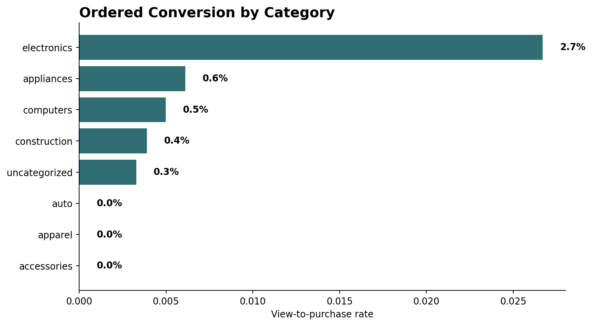

# Improving User Growth and Retention Using Product Analytics

Product analytics case study using a real e-commerce event dataset with product views, cart events, and purchases. 
The key insight: conversion failure occurs before intent formation, not during checkout, making early funnel optimization the highest-leverage growth opportunity.


## Project Overview

This project analyzes where users lose momentum in an e-commerce shopping journey and recommends what the product team should improve first.

The core finding: **the biggest measured bottleneck is product activation, not checkout.** Only **2.82%** of viewed users add to cart after viewing, while **48.48%** of cart users purchase after carting.

## Business Problem

The product team wants to understand:

- Where users drop off between view, cart, and purchase
- Which categories convert best
- How users should be segmented for product action
- Whether retention can be evaluated from the available data
- Whether a proposed Variant B experience should ship

## Key Results Snapshot

| Metric | Result |
|---|---:|
| Cleaned events | 49,985 |
| Users | 10,537 |
| Sessions | 12,436 |
| Ordered view-to-cart rate | 2.82% |
| Ordered cart-to-purchase rate | 48.48% |
| Ordered view-to-purchase rate | 1.37% |
| Purchaser share | 4.36% |
| Same-window repeat-session rate | 12.33% |
| Purchase revenue | $164,058.23 |
| A/B simulation p-value | 0.621 |

## Interpretation

- The primary bottleneck is early funnel activation, not checkout efficiency.  
- Conversion improves significantly after cart (48.48%), meaning users who show intent are likely to complete purchase.  
- The largest opportunity lies in converting browsing behavior into purchase intent, not optimizing late-stage checkout.  

## Dashboard Preview




## Insights

- **View-to-cart is the largest bottleneck.** 97.18% of viewed users do not add to cart, so the first product priority should be improving product discovery and product detail pages.
- **Checkout is not the primary constraint.** Conversion after cart (48.48%) is significantly stronger, indicating that users who show intent are likely to complete purchase.
- **Electronics is the strongest category.** It delivers 2.67% ordered view-to-purchase conversion and $121,229.39 in revenue.
- **Uncategorized products create a decision-quality problem.** 17,028 rows were missing category code, and uncategorized conversion is only 0.33%.
- **Browsers dominate the user base.** 94.17% of users viewed but did not cart or purchase.
- **The A/B simulation does not justify shipping Variant B.** Variant B shows a slight uplift, but p = 0.621 indicates the result is not statistically significant. This highlights the importance of disciplined experimentation — product decisions should not be based on directional improvements alone.

Full findings: [insights/key_findings.md](insights/key_findings.md)

## Final Recommendation

The highest-impact product decision is to improve **view-to-cart conversion** before investing in checkout optimization or acquisition. The product team should focus on product detail page clarity, category taxonomy, recommendations, pricing confidence, delivery/returns messaging, and stronger cart calls to action.

Use electronics as the benchmark category and fix uncategorized taxonomy before making merchandising decisions from category reporting. Request a longer event window before making retention or lifecycle roadmap decisions.

## Dataset

Source file:

```text
data/sample/sample_data.csv
```

Cleaned output:

```text
data/processed/events_clean.csv
```

The dataset includes:

- event timestamp
- event type
- product and category identifiers
- category code
- brand
- price
- user ID
- user session

Device is not available in this dataset, so device segmentation is intentionally excluded.

## Methodology

- Cleaned timestamps, missing categories, missing brands, numeric price values, and duplicate rows.
- Built an ordered funnel: `view -> cart -> purchase`.
- Segmented funnel performance by category and hour.
- Created first-interaction retention cohorts.
- Built user segments: purchasers, cart abandoners, browsers, and inactive users.
- Simulated A/B assignment while using observed purchase outcomes only.
- Generated dashboard visuals from processed tables.

## Repository Structure

```text
product-analytics-case-study/
├── data/
│   ├── sample/
│   └── processed/
├── sql/
├── python/
├── dashboard/
│   └── assets/
├── case-study/
├── insights/
├── README.md
├── requirements.txt
└── .gitignore
```

## How To Run

```bash
pip install -r requirements.txt
python python/data_cleaning.py
python python/funnel_analysis.py
python python/retention_analysis.py
python python/segmentation.py
python python/ab_testing.py
python python/generate_dashboard_assets.py
```

## Project Links

- Case study: [case-study/product_case_study.md](case-study/product_case_study.md)
- Metrics: [insights/metric_definitions.md](insights/metric_definitions.md)
- Dashboard design: [dashboard/dashboard_design.md](dashboard/dashboard_design.md)
- SQL logic: [sql/](sql/)
- Python analysis: [python/](python/)

## Limitations

- The dataset covers only one short window on 2019-11-01, so Day 1 and Day 7 retention are not observable.
- Device is not included, so device segmentation cannot be performed.
- A/B assignment is simulated for analysis practice; only the conversion outcomes come from observed data.
- Category and brand fields have missing values, which affects merchandising interpretation.

