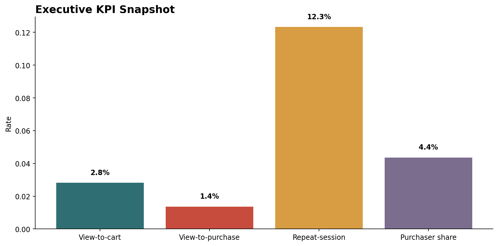
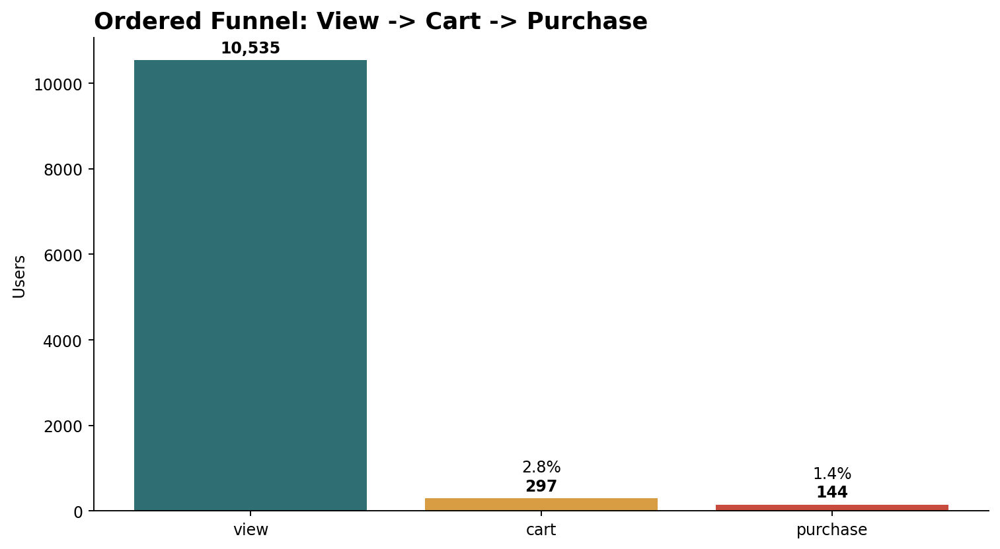
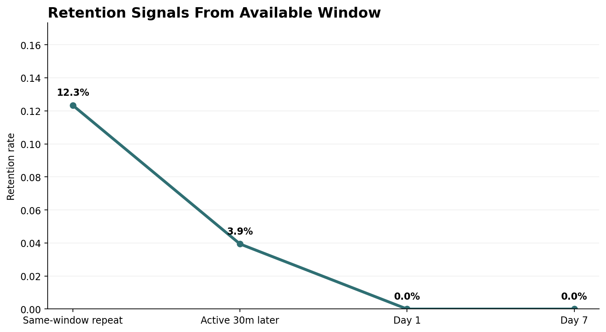
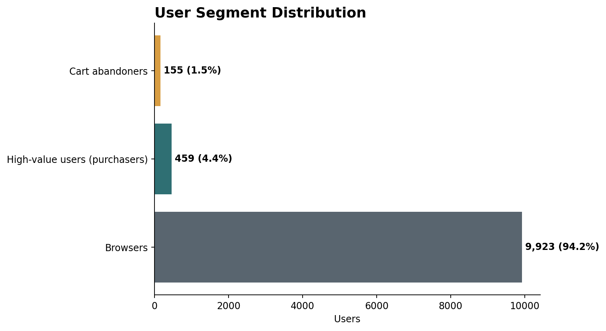
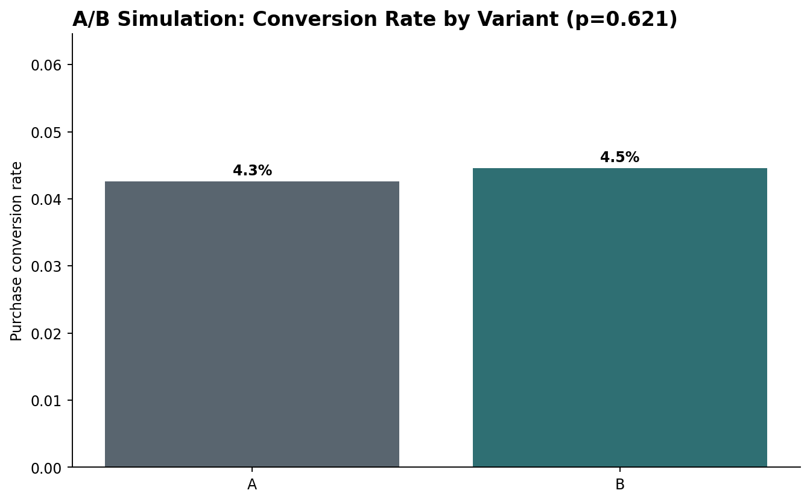

# Dashboard Design

The dashboard is designed for a Product Manager reviewing conversion quality in the e-commerce funnel. It uses the cleaned event dataset and the processed analysis tables in `data/processed/`.

## Page 1: Executive Overview

**KPIs**

- Ordered view-to-cart rate: **2.82%**
- Ordered view-to-purchase rate: **1.37%**
- Same-window repeat-session rate: **12.33%**
- Purchaser share: **4.36%**

**Charts**

- Executive KPI snapshot
- Ordered funnel
- Segment distribution
- Category conversion

**Business usage**

Use this page to decide whether the current product priority should be activation, checkout, retention, or category merchandising.

## Page 2: Funnel Analysis

**KPIs**

- View users: **10,535**
- Cart users after view: **297**
- Purchase users after cart: **144**
- View-to-cart drop-off: **97.18%**
- Cart-to-purchase drop-off: **51.52%**

**Charts**

- Funnel chart
- Conversion by category
- Conversion by hour

**Business usage**

The funnel shows that the largest measured loss happens before cart. This page should guide PDP, category page, and merchandising priorities before the team over-invests in checkout-only fixes.

## Page 3: Retention Analysis

**KPIs**

- Same-window repeat-session users: **1,299**
- Same-window repeat-session rate: **12.33%**
- Active 30 minutes later: **3.94%**
- Day 1 retention: **0.00%**
- Day 7 retention: **0.00%**

**Charts**

- Retention proxy curve
- Cohort summary

**Business usage**

The dataset is too short to support true Day 1 or Day 7 retention decisions. This page should be used to communicate that limitation and track short-window repeat behavior until a longer extract is available.

## Page 4: Customer Segmentation

**KPIs**

- Browsers: **9,923 users**
- Purchasers: **459 users**
- Cart abandoners: **155 users**
- Purchase revenue: **$164,058.23**

**Charts**

- Segment distribution
- Revenue by segment
- Segment behavior table

**Business usage**

Use this page to match product actions to user intent: activation for browsers, cart recovery for abandoners, and value protection for purchasers.

## Page 5: A/B Test Results

**KPIs**

- Variant A conversion: **4.26%**
- Variant B conversion: **4.45%**
- Absolute lift: **0.20 percentage points**
- P-value: **0.621**
- Decision: **Do not ship based on this result**

**Charts**

- Variant conversion comparison
- Statistical readout

**Business usage**

Use this page to separate apparent lift from statistically reliable product impact. The current simulated assignment is useful as a framework, but not as evidence to ship.

## Filters To Add In BI

- Category
- Brand
- Event hour
- User segment
- Product ID

Device is not available in the provided dataset, so device segmentation is intentionally excluded rather than inferred.

